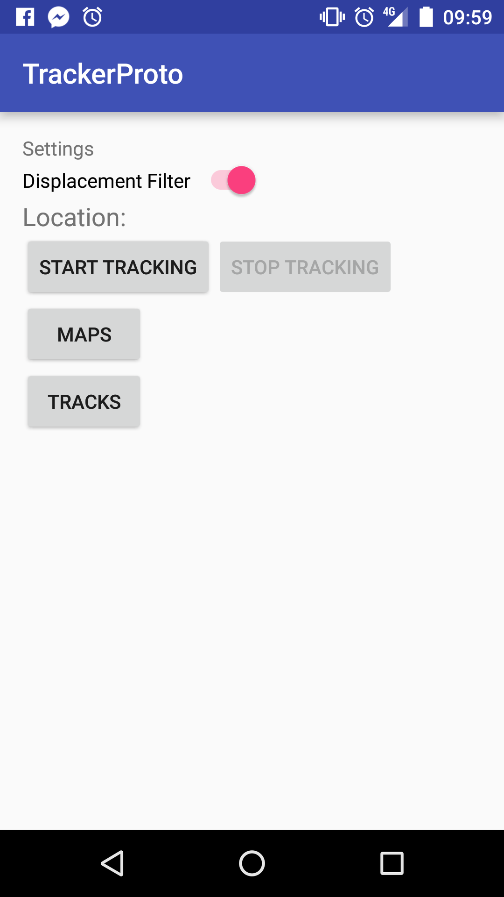
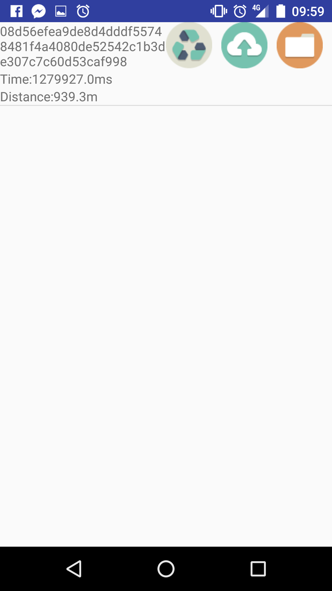
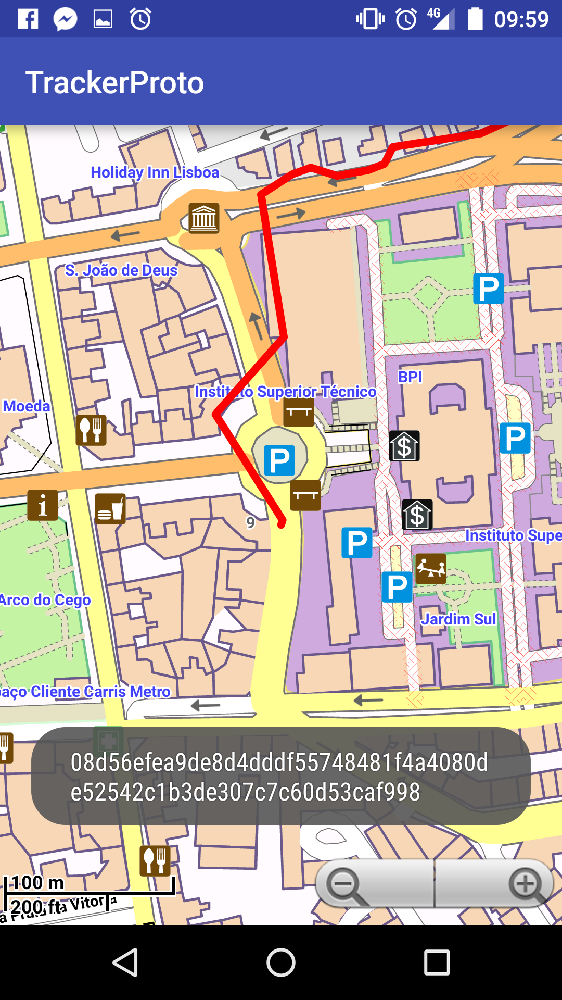
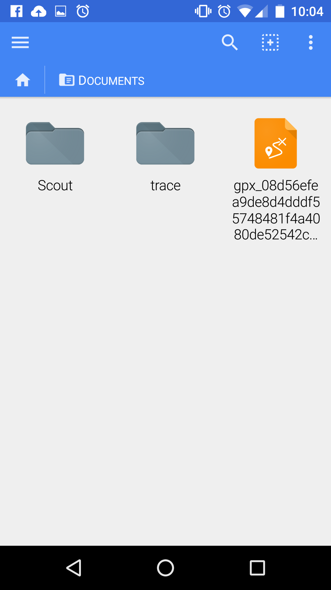
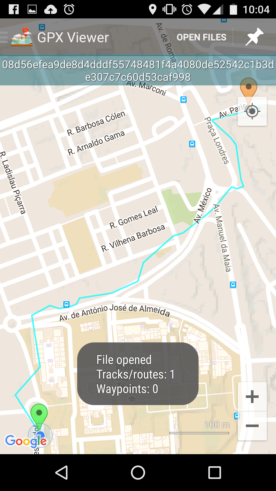

# TrackerProto
Prototype for the TRACE Tracker App

## Actividades (UI)

### MainActivity

Permite iniciar e parar o processo de tracking, bem como acesso às restantes actividades.

### TrackListActivity

Sempre que uma sessão de tracking é terminada, esta é guardada como uma serialização do
objecto `Track`. Todas as `Track`s serializadas podem ser visualizadas nesta actividade.
Esta actividade permite ainda:

- Remover a `Track`
- Uploading da `Track` para o servidor `TRACEStore`. (Apenas é permitido uma vez)
- Exportação da `Track` para memória pública (`/Documents`) como um ficheiro `.gpx`

Para além disso, a selecção de uma das `Tracks` listada na activade, permite ainda
a pré-visualização das trajectórias registadas *in-app*.

Todas as `Track`s exportadas podem ser encontradas na pasta `/Documentos` do dispositivo,
sob o formato GPS Exchange Format (`.gpx`). Este formato tem a vantagem de já existirem
vários "visualizadores" do mesmo, como é exemplo na segunda imagem.

## Diagramas de Sequência

### Login e Gestão da Sessão

### Tracking

